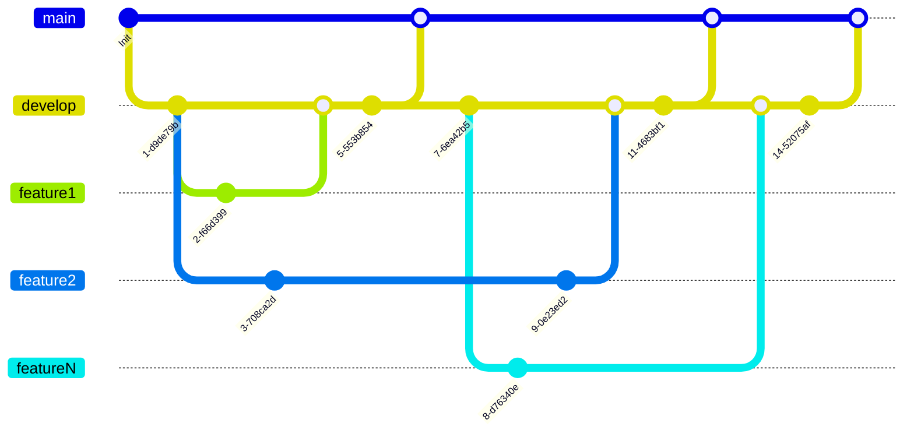

# Summary

1. [Git](#git)
   - [Commit](#commit)
   - [Flow](#flow)
2. [Code](#code) 
   - [Notations](#notations)
   - [Includes order](#includes-order)


# Git

---

## Commit

A commit is of the form:
- an action in braces
- a brief description

Example:  
{Update} Maths for cube collisions

## Flow




# Code

---

## Notations

Notation        | Element
-------         | ------
m_camelCase     | class members
camelCase       | other variables
PascalCase      | functions / structures / classes
snake_case      | files
CAPITAL         | enum

## Includes order

```c++
#include "my_file.h" // just in my_file.cpp

#include <standard libraries>

#include "other_files.h"
```

<br>

[Head of page](#summary)