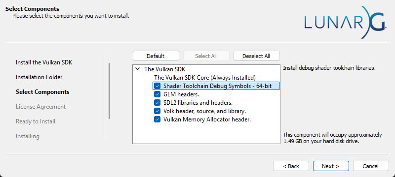

## Required components

### CMake
The **CMake build-tools** are used to allow using any compiler and IDE.\
Install the **CMake build-tools** [here](https://cmake.org/download/).

The **CMake integration tools** for your **IDE** are also required to be able to directly open the root directory and work from there.\
\
Ex: Install Visual Studio's **CMake integration tools** from the Visual Studio Installer:\


### Vulkan SDK
In order to link and compile the Vulkan example, the Vulkan SDK is required.\
/!\ When installing the Vulkan SDK, be sure to select the **Shader Toolchain Debug Symbols** to be able to link the GLSL shader compiler library (_libshaderc_combined_d.lib_) in debug:


## Initialization

Start by **cloning** the **repository**.
```
git clone https://github.com/Raymarching-PFE/Physicated_Raymarching.git
cd Physicated_Raymarching
```

Then init the **submodules** to fetch the **dependencies** using the command:
```
git submodule update --init --recursive
```

Now the project is ready to be open directly from the **root directory** using your IDE in "_CMake mode_".
# Summary

1. [Spacial Partitioning](#spacial-partitioning)
   - [General](#general)
   - [Slice](#slice)
   - [Nodes](#nodes)
   - [Nearest neighbour](#nearest-neighbour)

# Spacial Partitioning

---

## General

In this project, we use point clouds.
Point clouds are files with information about 3D points in space.
We choose the .PLY (Polygon file format).

Because we need to handle many points (really a lot of points),
we need an algorithm to render points efficiently.

We use a BVH bounding volume hierarchy to access the points efficiently.

We use an octree to store the points in a binary tree.

## Slice

We use slices to be sure the number of points are equal in all the subtrees.

## Nodes

in the nodes, the position is the slice value or the point value.
If the node is a leaf, that is a point, else, that's a slice.

## Nearest neighbour

The nn problem is easier after the space partitioning.

But, there is a problem, like you can see on that picture.
In some circumstance , the nn is not in the same box as the source point.
To fix that issue, we need to check the distance between the nearest point 
in the bax and check all the box around in range.

[Head of page](#summary)
