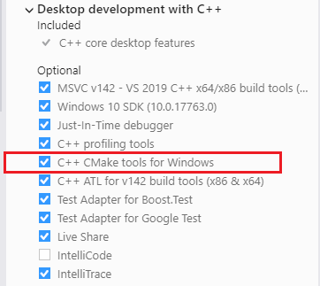

## Required components

### CMake
The **CMake build-tools** are used to allow using any compiler and IDE.\
Install the **CMake build-tools** [here](https://cmake.org/download/).

The **CMake integration tools** for your **IDE** are also required to be able to directly open the root directory and work from there.\
\
Ex: Install Visual Studio's **CMake integration tools** from the Visual Studio Installer:\


### Vulkan SDK
In order to link and compile the Vulkan example, the Vulkan SDK is required.\
/!\ When installing the Vulkan SDK, be sure to select the **Shader Toolchain Debug Symbols** to be able to link the GLSL shader compiler library (_libshaderc_combined_d.lib_) in debug:


## Initialization

Start by **cloning** the **repository**.
```
git clone https://github.com/Raymarching-PFE/Physicated_Raymarching.git
cd Physicated_Raymarching
```

Then init the **submodules** to fetch the **dependencies** using the command:
```
git submodule update --init --recursive
```

Now the project is ready to be open directly from the **root directory** using your IDE in "_CMake mode_".